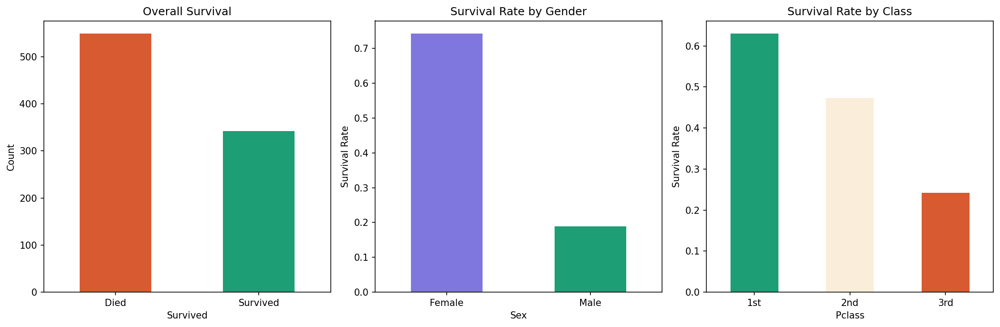
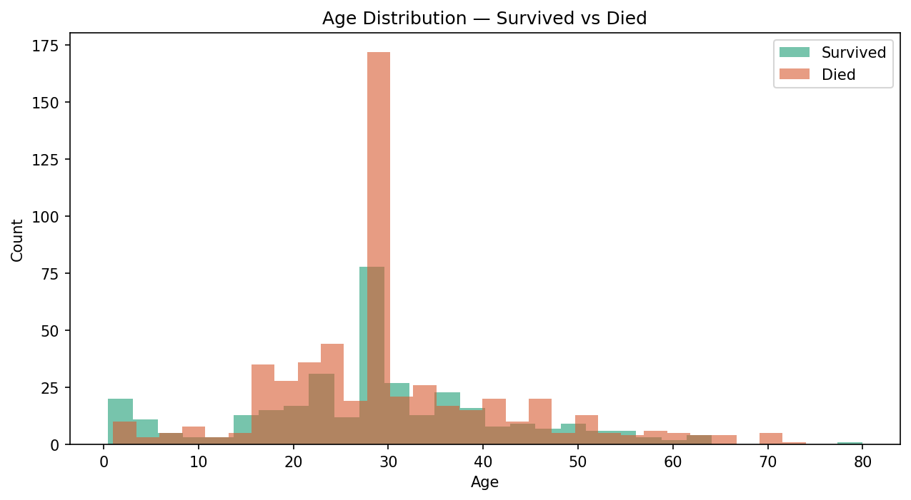

# Data Explorer 📊

Exploratory data analysis on the Titanic dataset using Python, 
Pandas, NumPy and Matplotlib.

## Key Insights Discovered

- Only **38.4%** of passengers survived
- Women survived at **4x** the rate of men (74% vs 19%)
- 1st class passengers survived at nearly **3x** the rate of 3rd class (63% vs 24%)
- Children under 10 had higher survival rates than adults
- **64.5%** of survivors aged 25-35 were female

## Charts

## Tech stack
- Python 3.11
- Pandas
- NumPy
- Matplotlib
- Jupyter Notebook

## How to run it

1. Clone the repo
   git clone https://github.com/SaadRoshan/data-explorer.git
   cd data-explorer

2. Create a virtual environment
   python -m venv venv
   venv\Scripts\activate

3. Install dependencies
   pip install -r requirements.txt

4. Launch Jupyter
   jupyter notebook

5. Open titanic-analysis.ipynb and run all cells

## What I learned
- Loading and cleaning real-world messy data with Pandas
- Handling missing values — when to drop vs when to fill
- Groupby operations to find patterns across categories
- Visualising data with Matplotlib
- Forming hypotheses from data and testing them